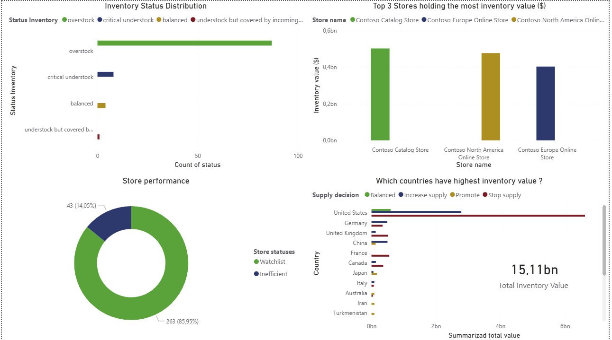
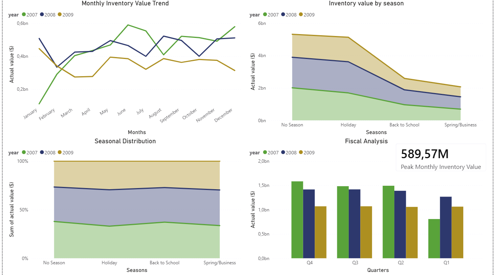
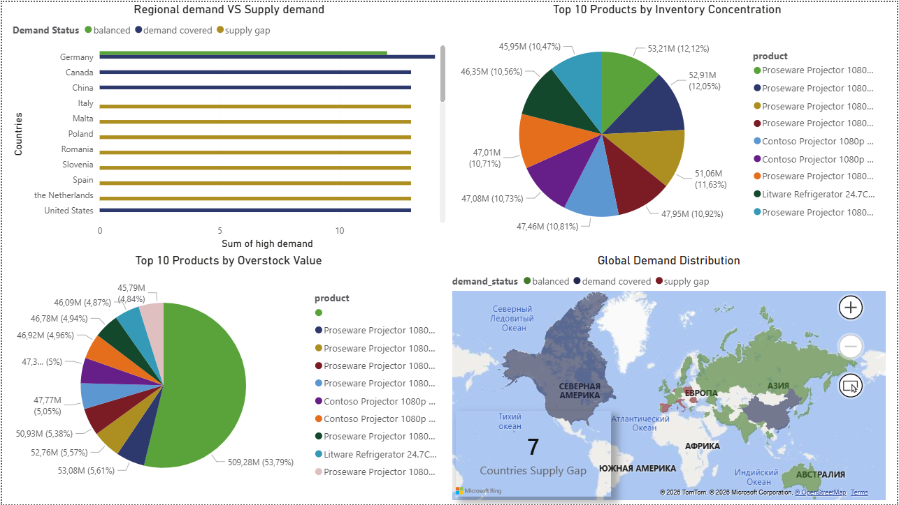
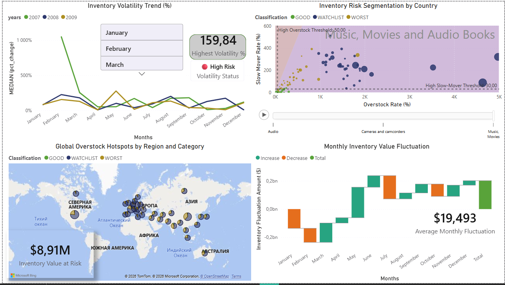

# Inventory Analytics Project

End-to-end SQL analytics project analyzing inventory performance across products, stores, regions, and time periods using a star schema data warehouse.

## 📊 Business Context

This project analyzes inventory health to identify:
- Slow-moving and dead stock
- Overstock and understock situations
- Regional supply chain inefficiencies
- Store performance patterns
- Inventory value concentration

## 🛠 Technical Stack

- **Database:** PostgreSQL
- **Query Environment:** VS Code, pgAdmin
- **Visualization:** Power BI
- **Data Exploration:** Excel, CSV's 
- **Techniques:** Window functions, CTEs, multi-layered transformations, percentile analysis

## 📁 Project Structure

### 1. Slow-Moving Inventory
Identifies products with excessive days in stock that tie up capital and storage space.

### 2. Stock vs Demand Imbalance
Classifies inventory status by comparing on-hand, on-order, and safety stock quantities.

### 3. Store Performance Comparison
Scores stores as Efficient, Inefficient, or Watchlist based on overstock, understock, and slow-mover metrics.

### 4. Geography Analysis
Generates regional supply chain decisions (increase supply, reduce supply, promote) based on inventory patterns.

### 5. Time-Based Trends
Analyzes monthly, seasonal, and fiscal quarter inventory patterns.

### 6. Inventory Concentration
Applies Pareto principle to identify top 20% of products holding 80% of inventory value.

### 7. Regional Demand vs Supply Mismatch
Detects supply gaps where high demand regions have insufficient inventory.

### 8. Value Drivers of Overstock
Analyzes which products contribute the most to overstocked inventory value, helping identify where excess capital is tied up and where inventory reduction efforts should be prioritized.

### 9. Inventory Volatility Over Time
Identifies periods with highest inventory value fluctuations to improve forecasting.

### 10. Multi-Dimensional Analysis ⭐
**Most complex query** - Combines product categories, geography, and time to rank worst-performing categories using composite metrics (overstock + slow movers). Includes month-over-month trend analysis and three-tier classification system.

## 🎯 Key Insights Delivered

- Store efficiency scoring based on multiple inventory health metrics
- Product category performance rankings by region
- Supply chain decision recommendations per geography
- Identification of inventory volatility periods
- Capital concentration analysis (Pareto)

### 📊DASHBOARDS

This project includes 4 comprehensive Power BI dashboards visualizing all 10 SQL queries:

### Dashboard 1: Store & Regional Overview 🌏
- Inventory status distribution across stores
- Top stores by inventory value
- Store efficiency scoring (Efficient/Inefficient/Watchlist)
- Regional supply chain recommendations

---

### Dashboard 2: Time-Based Trends 💫
- Monthly inventory value trends (2007-2009)
- Seasonal inventory patterns
- Fiscal quarter analysis
- Peak monthly inventory KPI

---

### Dashboard 3: Demand vs Supply & Product Concentration 🎩
- Regional demand vs supply gap analysis
- Top 10 products by inventory concentration (Pareto)
- Top 10 products by overstock value
- Global demand distribution by region

---

### Dashboard 4: Volatility & Risk Segmentation ⭐
- Inventory volatility trend by month
- Risk quadrant analysis (overstock vs slow movers)
- Global overstock hotspots by region and category
- Monthly inventory fluctuation analysis

---

**Questions or feedback?** Feel free to reach out!